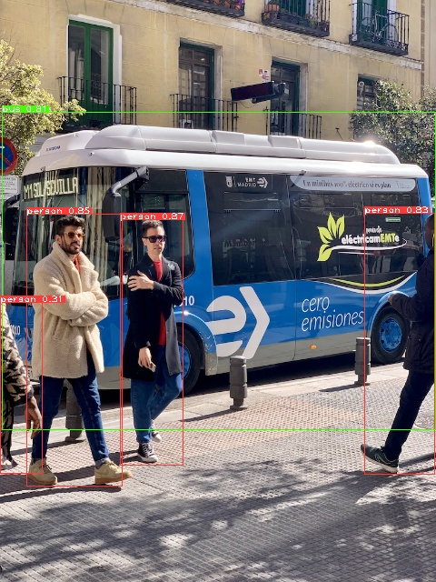

## Introdution

Deploy ultralytics [Yolov5](https://github.com/ultralytics/yolov5.git) pretained model with C++ language ;

<div align="center">

</div>


## Env
1. GCC 7.5
2. Opencv 4.5.4

## Docker Build
```
docker build -f docker\dockerfile -t onnx-yolo5 .
```

### Build performed in docker
(OpenCV C++ installation)[https://docs.opencv.org/4.x/d7/d9f/tutorial_linux_install.html]

## Infer with Docker
```
docker run onnx-yolo5 yolov5n {path_to_input}
```
